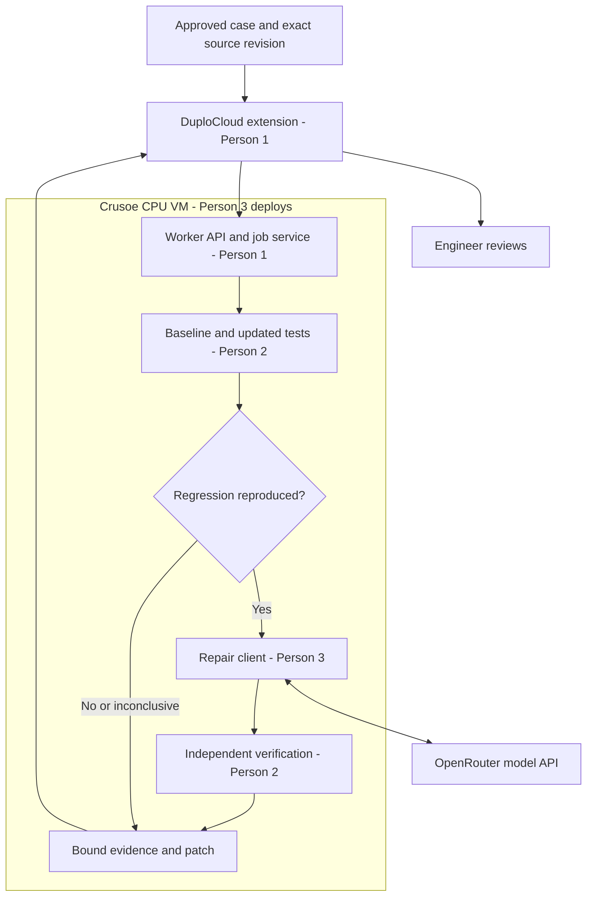

# ProofRun — core integration and three-chat build plan

Status: **PLANNED; live integrations unverified.** Source baseline: `7118d720ea2ae3e9bc3a2a4f7f61540348086451`, inspected September 29, 2026. Read [CLAUDE.md](CLAUDE.md) for current capabilities, commands, ownership and evidence rules. [OPTIONAL_SPONSORS.md](OPTIONAL_SPONSORS.md) stays deferred until the core gate passes.

## 1. First milestone and architecture

Press **Run verification** in a local DuploCloud extension, execute the existing prepared case through a Python worker, and display actual measured evidence. The first bridge may run locally and use the checked-in fix, with both facts labeled. It is not the complete sponsor demonstration.

The core then adds an OpenRouter-generated candidate, independent verification and real worker execution on Crusoe. The DuploCloud DevKit remains local; its local development license does not establish permission for production platform hosting.



The worker accepts registered cases and exact approved source bundles, not arbitrary shell commands. Build pinned images before testing; test containers remain without network or model credentials. Later HTTP replay against staging requires a separate network-enabled client and actual deployment identity.

## 2. Sponsor setup and proof of contribution

Capabilities are documented, not authenticated/runtime-tested here. Event credits and eligibility remain unverified; integration success alone does not guarantee an award.

### DuploCloud — Person 1

Needs Docker with modern Compose, Python 3, work-email verification, model access and available ports. Official authoring uses Claude Code. Personal email domains are rejected; source/runtime licensing differs. [DevKit README](https://github.com/duplocloud/devkit/blob/main/README.md) · [Hack Day setup](https://github.com/duplocloud/devkit/blob/main/hackday/Installing%20DevKit.md)

Keep the DevKit in a sibling directory, preserving ProofRun's repository and origin. From the parent directory, if that sibling does not already exist:

```bash
git clone https://github.com/duplocloud/devkit.git proofrun-duplocloud-devkit
cd proofrun-duplocloud-devkit
./run.sh
```

Use the setup flow for verification and credentials; do not run its repository-adoption script over ProofRun. Confirm services run, sign in at `http://localhost:4210`, select `extension-dev` and obtain a real agent response. Let the setup flow manage gateway configuration. OpenRouter documents an Anthropic-compatible route for this setup, but the selected model and actual startup must be verified. [Gateway instructions](https://openrouter.ai/docs/guides/coding-agents/claude-code-integration)

The no-cloud worker sample tests resource execution/result persistence. From the DevKit root:

```bash
./scripts/build-extension.sh samples/worker-compute
./scripts/deploy-extension.sh samples/worker-compute/dist/extension.zip
```

It demonstrates `ResourceWorkerBase`, `ApplyAsync` and `SaveProgressAsync`, useful for dispatch/poll behavior. A calculation result proves neither model access nor ProofRun. [Worker sample](https://github.com/duplocloud/devkit/blob/main/samples/worker-compute/README.md)

Build the custom C# backend/Angular UI against the running platform SDK. Keep custom source in proposed `extensions/proofrun/`. It calls the worker API, never the Docker socket. Test networking from the actual container: its `localhost` is not the laptop. [Architecture](https://github.com/duplocloud/devkit/blob/main/docs/architecture.md)

Show job identity, measured outcomes and artifacts in the portal. Deployment triggers are later: status/result hooks exist, but readiness, URL, revision and deduplication still need wiring. [Hook reference](https://github.com/duplocloud/devkit/blob/main/.claude/skills/duplo-extension-dev/reference/04-hooks.md)

### Crusoe — Person 3

Use an authorized account/project with available credits/quota and a CPU VM. Record VM identity, OS/architecture, worker revision and reachable network route. Install the Python/Docker runtime, prepare pinned images and deploy the same worker interface tested locally. This first fixture needs no GPU. [VM types and availability](https://docs.crusoecloud.com/compute/virtual-machines/overview/)

Connect through a private route or authenticated HTTPS; do not expose Docker directly. Execute the case on the VM and retain actual artifacts plus host identity. A local fallback is useful development evidence, not Crusoe integration. Crusoe inference through a model gateway would be a different architecture and does not prove this worker ran there. No VM was provisioned in this task.

### OpenRouter — Person 3

Requires a key with usable limits/credit and an available selected model. Use server-side bearer authentication with `POST https://openrouter.ai/api/v1/chat/completions`. Send bounded source, failure evidence and approved requirements; validate the proposal response. Record requested/returned model identifiers, operation reference and candidate provenance. [Quickstart](https://openrouter.ai/docs/quickstart) · [Authentication](https://openrouter.ai/docs/api_reference/authentication)

Do not assume an SDK is installed: existing `requests` can perform the HTTP call. Choose an explicit model during setup. A connectivity greeting is only preflight; the model must materially produce the claimed proposal/analysis. If unavailable, preserve the reproduced finding and mark repair unavailable. Never silently substitute a prepared fix while claiming generated repair.

### Target configuration — proposed, not implemented

This replaces the inherited configuration guidance. These settings are not all understood by today's code.

| Setting / setup item | Consumer | Responsibility |
|---|---|---|
| `OPENROUTER_API_KEY` | Repair service | Model authentication; never enters test containers |
| `PROOFRUN_MODEL` | Repair service | Explicit model selected at setup |
| `PROOFRUN_WORKER_URL` | Extension backend | Reachable local/remote worker URL |
| `PROOFRUN_WORKER_TOKEN` | Extension and worker | Server authentication; never browser data |
| `PROOFRUN_ARTIFACT_DIR` | Worker | Private persisted evidence location |
| `PROOFRUN_EXECUTION_TARGET` | Worker | `local` / `crusoe`; a label alone is not hosting evidence |
| Setup-managed DuploCloud settings | DevKit | Admin verification, gateway and workspace |
| Crusoe account/VM access | Deployment operator | Provisioning and host management, outside test containers |

Put pins, image identities, test limits and case selection in versioned manifests. Person 3 owns configuration/example-file migration. Do not add legacy provider credentials to these requirements. Existing imports may still require code/dependency cleanup even for a credential-free offline entry point.

## 3. Shared contracts — agree before parallel edits

Version: `proofrun.v1`. Owner: Person 1; Persons 2 and 3 acknowledge it before implementing consumers. All endpoints, new modules and types below are **proposed**, not callable features at the inspected baseline.

One worker, one concurrent run and file-backed records/artifacts are enough. Use atomic state writes; avoid a new queue/database. An interrupted job after restart must not appear completed.

### HTTP boundary

- `POST /v1/runs`: validate a registered case and bindings; return `202` with run ID, then execute asynchronously.
- `GET /v1/runs/{run_id}`: return execution/finding/repair states and evidence references.
- `GET /v1/runs/{run_id}/artifacts/{artifact_id}`: authenticated access to that run's allowed artifacts, never arbitrary paths.
- Identical input with the same `job_key` returns the existing run; changed input using the same key returns `409`. Invalid bindings or unregistered cases fail validation before execution. Authentication errors are separate from application failures.

Illustrative submission. Replace angle-bracket placeholders with calculated identifiers; reject them literally in implementation.

```json
{
  "schema_version": "proofrun.v1",
  "job_key": "demo-001",
  "case_id": "customer-nickname-v1",
  "source": {
    "repository": "https://github.com/Eman-Gon/ProofRun",
    "revision": "<full-commit-sha>",
    "module": "demo/upgrade/app.py",
    "sha256": "<source-sha256>"
  },
  "contract": {"id": "customer-input-v1", "sha256": "<contract-sha256>"},
  "environments": {"baseline": "pydantic-1.10.18", "updated": "pydantic-2.8.2"},
  "repair": {"enabled": true, "max_attempts": 2}
}
```

Resolve environment labels from an approved manifest; record actual immutable image IDs, requirements hashes and observed versions. Validate source revision/content. Represent uncommitted application changes by an explicit bundle hash rather than silently attributing them to HEAD. First allow only the checked-in case, not submitted shell commands, arbitrary URLs or executable tests.

Illustrative response summary, not an observed result:

```json
{
  "schema_version": "proofrun.v1",
  "run_id": "run-demo-001",
  "job_key": "demo-001",
  "execution_status": "completed",
  "finding_status": "regression_reproduced",
  "repair_status": "verified",
  "bindings": {
    "revision": "<full-commit-sha>",
    "source_sha256": "<source-sha256>",
    "contract_sha256": "<contract-sha256>",
    "candidate_sha256": "<candidate-sha256>",
    "environment_manifest_sha256": "<environment-manifest-sha256>"
  },
  "execution": {"target": "crusoe", "worker_id": "<recorded-worker-id>"},
  "proposal": {"mode": "live", "gateway": "openrouter", "model": "<returned-model-id>"},
  "cases": [
    {"id": "nickname_omitted", "stage": "baseline", "status": "passed"},
    {"id": "nickname_omitted", "stage": "updated", "status": "failed"},
    {"id": "nickname_omitted", "stage": "repaired_updated", "status": "passed"},
    {"id": "nickname_object_rejected", "stage": "repaired_updated", "status": "passed"}
  ],
  "artifacts": ["case-results.json", "verification.json", "candidate.patch"],
  "limitations": ["One configured model; complete case matrix is in verification.json"]
}
```

This abbreviated response alone cannot establish `verified`. The complete artifact must include all expected case IDs, original-suite results and environments. Record exit codes, actual versions, commands, expected/observed behavior, elapsed time, test hashes and output references.

### Internal Python boundaries

| Proposed call | Owner → consumer | Output |
|---|---|---|
| `run_comparison(case_spec, source_bundle)` | Person 2 → Person 1 service | `ComparisonEvidence`: bindings, actual environments, expected/executed cases, observations, finding and artifacts |
| `propose_patch(failure_context, attempt)` | Person 3 → Person 1 service | `PatchProposal`: base hash, allowed path, diff/replacement, rationale, model provenance; no verdict |
| `verify_candidate(case_spec, source_bundle, proposal)` | Person 2 → Person 1 service | `VerificationEvidence`: candidate hash, original suite/controls, completeness and deterministic verdict |

Person 1 owns shared schema definitions in `src/proofrun/contracts.py`; request changes instead of creating incompatible types. Person 1's service limits proposals to two attempts. Person 2 applies allowed edits in disposable copies and validates the tested content against the returned patch. Person 3 cannot edit acceptance tests or expected outputs.

### State semantics

| Field | Values | Meaning |
|---|---|---|
| `execution_status` | `queued`, `running`, `completed`, `setup_failed`, `timed_out`, `interrupted` | Workflow execution; completed does not mean the application passed. |
| `finding_status` | `not_tested`, `regression_reproduced`, `no_difference_observed`, `inconclusive` | A supported baseline pass/update failure establishes reproduction; unrelated crashes do not. |
| `repair_status` | `not_requested`, `pending`, `proposed`, `verified`, `rejected`, `unavailable` | Only the verifier sets verified; model refusal/outage means unavailable. |

Preserve a reproduced finding when repair fails. A setup error cannot become no difference. Hash/environment mismatch invalidates acceptance. Show all three states instead of a single misleading green badge. Current CLI exit `1` confirms the prepared break; it is not automatically a worker failure.

## 4. Verification plan — Person 2 owns truth

The existing fixture and checked-in fix are prepared examples. Generalize configuration before claiming support for other model/field names.

Required cases: omitted nickname normalized as approved; null accepted; valid string unchanged; object nickname rejected; missing required name rejected. Rerun every original test on original and repaired code across both pinned environments where the approved contract applies. Record the expected regression without treating it as an infrastructure failure.

Negative demonstration: compare a narrow explicit-default patch with an intentionally permissive candidate accepting any value. Both may remove the omission error; only one preserving the independent controls can pass. This is a planned experiment, not a recorded result.

Reject empty, missing, duplicate or wrong test sets; stale bindings; verifier edits; unsupported imports; incorrect runtime versions; and setup failures. Preserve isolation/timeouts. Hash the candidate after patch application and ensure those exact files produced the evidence.

## 5. Milestones, dependencies and time box

Assume accounts, DevKit images and test images are ready before the six-hour window. Setup blockers consume time; reduce scope without renaming incomplete work as complete.

| Checkpoint | Person 1 | Person 2 | Person 3 | Exit evidence |
|---|---|---|---|---|
| Before build | Portal/sample; agree contracts | Inspect/offline baseline | Confirm model/VM access | Access record and source-grounded baseline |
| Hour 0–1 | API/extension bridge | Adapt prepared evidence | Provider config/host setup | Actual local comparison displayed in portal |
| Hours 1–3 | Consume agreed results | Original-suite repair runs, controls, states | Model proposals and Crusoe worker | Bad candidate rejected; actual model output |
| Hours 3–4.5 | Integrate repair loop/remote endpoint | Full candidate matrix remotely | Real VM execution and provenance | Generated candidate with remote measured results |
| Hours 4.5–6 | UI/rehearsal/completion record | Negative/freshness checks | Restart/setup verification | Reproducible integrated demonstration |

Person 2's offline work and Person 3's access checks can proceed while Person 1 sets up DevKit. Label temporary API fixtures as mocks; they unblock UI work but cannot satisfy the live gate.

Cut automatic deployment hooks, PR publication, a second compatibility scenario and optional sponsors first. If model or VM access fails, retain a useful local demo and mark the affected core gate blocked. Do not use optional integrations to obscure incomplete core work.

## 6. Copy-ready prompts for three separate chats

Open three separate agent chats against this repository. Give each chat its own assigned branch/worktree, then paste **only its complete text block below**. Each prompt tells the agent to read the shared documents before implementing.

Start Person 1 first to establish the shared interface. Persons 2 and 3 can inspect the runner and check prerequisites in parallel, but must use Person 1's agreed contract before integrating. If all chats share one checkout, enforce the file ownership in `CLAUDE.md`; separate chat windows alone do not prevent conflicting edits.

- [Person 1: DuploCloud and integration](#person-1--duplocloud-and-integration)
- [Person 2: verification engine](#person-2--verification-engine)
- [Person 3: repair and sponsor infrastructure](#person-3--repair-and-sponsor-infrastructure)

### Person 1 — DuploCloud and integration

```text
You are Person 1 of a three-person ProofRun build: the DuploCloud and integration lead. Begin implementing your assigned work, not just proposing a plan.

Repository: https://github.com/Eman-Gon/ProofRun
Use the existing checkout and your assigned branch/worktree. First read CLAUDE.md, INTEGRATION.md and any applicable repository instructions. Inspect git status and current implementation; preserve other people's changes. Do not assume this chat shares context with the other two chats.

Product: ProofRun checks approved customer-input behavior across a supported Python/Pydantic update, proposes a bounded repair and independently tests it. Core sponsors are DuploCloud for the workflow/UI, Crusoe for worker execution and OpenRouter for repair proposals.

Your first milestone: a Run verification action in DuploCloud invokes the existing runner and displays actual measured evidence. Local execution and a prepared fix are acceptable for this first bridge only when labeled accurately.

Own extensions/proofrun/, src/proofrun/contracts.py, api.py, service.py, __init__.py, corresponding API/contract tests and shared documentation. Follow CLAUDE.md for existing-file ownership. Person 2 owns verification; Person 3 owns repair and infrastructure. Request changes from their owners rather than editing their files.

Work in this order:
1. Check DevKit prerequisites and existing setup. Establish the local portal and a small working extension without replacing this repository.
2. Define the proofrun.v1 types and /v1/runs contract from INTEGRATION.md. Give Persons 2 and 3 a concise contract handoff before dependent implementation.
3. Build the worker adapter and show separate execution, finding and repair states, plus artifact links. Label temporary mocks explicitly.
4. Integrate Person 2's comparison/verifier and Person 3's model client and Crusoe endpoint. Own the bounded orchestration loop; never override the verifier's result.
5. Demonstrate the real round trip and record exact commands, results, revision and remaining limitations.

Keep secrets out of chat and frontend responses. If access is missing, identify the exact blocker and continue independent local work. Keep all optional sponsors deferred until the recorded core gate passes. Do not commit or push unless requested.

Finish each handoff with: changed paths; branch/worktree and revision or diff; interface version; checks actually run; evidence location; mocks or incomplete integrations; and the next action for Persons 2 and 3.
```

### Person 2 — verification engine

```text
You are Person 2 of a three-person ProofRun build: the verification-engine lead. Begin implementing your assigned work, not just proposing a plan.

Repository: https://github.com/Eman-Gon/ProofRun
Use the existing checkout and your assigned branch/worktree. First read CLAUDE.md, INTEGRATION.md and applicable repository instructions. Inspect git status and source before changing anything. Preserve teammate work; these chats do not automatically share context.

Product: ProofRun checks approved customer-input behavior across a supported Python/Pydantic update and independently verifies repairs. DuploCloud starts/displays the workflow; your tests execute on the worker that Person 3 hosts on Crusoe. OpenRouter proposes repairs but cannot decide whether they pass.

Own src/upgrade_demo.py, src/upgrade_sandbox.py, sandbox/upgrade.Dockerfile, demo/upgrade/, their verification tests, and proposed src/proofrun/runner.py and tests/test_proofrun_runner.py. Person 1 owns shared contracts/API/UI; Person 3 owns model and dependency/configuration files. Request shared changes through their owners.

Work in this order:
1. Inspect and reproduce the existing offline example once dependencies and images are ready. Its exit code 1 intentionally confirms the prepared regression; do not treat it as infrastructure failure.
2. Add original-suite execution on repaired code and independent omission, null, string, invalid-object and required-name controls.
3. Implement run_comparison and verify_candidate using Person 1's agreed proofrun.v1 types. Keep reproduced findings separate from repair failures.
4. Verify a narrow repair and reject a deliberately overpermissive candidate. The repairer must not edit your tests, expected outcomes or dependency pins.
5. Preserve exact source, contract, environment, test and candidate identities. Reject missing tests, incorrect versions, stale evidence and unsupported inputs. Maintain isolated, bounded Docker execution.

Deliver measured results and artifacts to Person 1, then run the same checks on Person 3's Crusoe worker. Never label mocked or saved output as a live execution. Continue useful offline work if another person's integration is unavailable. Keep optional work deferred. Do not commit or push unless requested.

Finish each handoff with: changed paths; branch/worktree and revision or diff; interface version; commands and results; evidence location; remaining scope limits; and what Persons 1 and 3 need next.
```

### Person 3 — repair and sponsor infrastructure

```text
You are Person 3 of a three-person ProofRun build: the repair-agent and sponsor-infrastructure lead. Begin implementing your assigned work, not just proposing a plan.

Repository: https://github.com/Eman-Gon/ProofRun
Use the existing checkout and your assigned branch/worktree. First read CLAUDE.md, INTEGRATION.md and applicable repository instructions. Inspect git status and implementation; preserve teammate work. Do not assume the three chats share conversation history.

Product: ProofRun reproduces a supported Python/Pydantic regression and tests a bounded repair. Your core sponsors are OpenRouter for model access and Crusoe for CPU-VM worker hosting. Person 1 owns DuploCloud/API integration; Person 2 owns the independent verifier.

Own proposed src/proofrun/repair.py, config.py, deploy/crusoe/, tests/test_proofrun_repair.py and the designated requirements/configuration files. Coordinate dependency changes with the other owners. Do not edit their implementation or the verifier's acceptance cases.

Work in this order:
1. Check available model and authorized VM access without printing secrets. Do not assume credits, keys or accounts exist. Report exact access blockers and continue local client/deployment preparation where possible.
2. Implement propose_patch against Person 1's agreed proofrun.v1 contract. Send bounded source, approved requirements and measured failure evidence to an explicitly selected OpenRouter model.
3. Return a permitted candidate with its base hash and actual model provenance. Handle invalid output, refusal, timeout and unavailable service explicitly; never disguise a prepared fix as a generated one.
4. Deploy the compatible worker on Crusoe, prepare pinned test environments and provide an authenticated reachable connection to Person 1. Routing model inference to Crusoe is not evidence of worker hosting.
5. Execute Person 2's checks on that worker and retain actual host, environment and test evidence. Keep model credentials outside test containers and browser data.

The repairer cannot edit tests, expected outputs or case dependency pins, and cannot declare a repair verified. Only Person 2's executed checks provide that verdict. Keep the local fallback labeled and all optional sponsors deferred until the core gate passes. Do not commit or push unless requested.

Finish each handoff with: changed paths; branch/worktree and revision or diff; interface version; actual model/worker checks; evidence location; access blockers; and connection details needed by Persons 1 and 2, excluding secrets.
```

## 7. Core completion record and demo

Person 1 updates this from handoff evidence. Writing documents does not complete any gate.

| Gate | Required evidence | Status |
|---|---|---|
| DuploCloud round trip | Actual resource/job and returned measured result | NOT VERIFIED |
| Crusoe contribution | VM/worker identity, source revision and execution artifacts | NOT VERIFIED |
| OpenRouter contribution | Actual proposal operation, model provenance and candidate | NOT VERIFIED |
| Reproduction | Approved baseline pass and supported update failure | NOT VERIFIED |
| Repair verification | Original suite and independent controls on accepted candidate | NOT VERIFIED |
| Bad-fix rejection | Permissive candidate rejected by approved controls | NOT VERIFIED |
| Evidence integrity | Source/case/environment/candidate binding; stale/empty evidence rejected | NOT VERIFIED |
| Fresh demonstration | Another teammate can repeat setup/run; failure states and limitations visible | NOT VERIFIED |

Two-minute demo: show the approved customer case, start the check in DuploCloud, display baseline/update evidence, show the generated patch and rejected permissive alternative, then the accepted candidate's complete verification report with real worker/model provenance. If execution takes longer, start earlier and label historical output honestly. Do not present a saved run as a new live execution.

Integrated revision: **not recorded**. Evidence/run ID: **not recorded**. Core status: **PLANNED**. When every gate passes, record `CORE_COMPLETE`, then evaluate one optional integration.

Handoff format:

```text
Person / task / branch or worktree:
Revision or uncommitted diff and changed paths:
Interface version / requested shared changes:
Commands and checks actually run:
Result and evidence location:
Live services / mocks / synthetic inputs:
Blockers and next owner:
```

Documentation validation: global Python 3.12 successfully ran the existing CLI help commands. No application tests, comparison runs, account registrations, model calls, VM provisioning or deployments were executed. Setup/build/test commands were source-checked; proposed interfaces need implementation and runtime validation.
