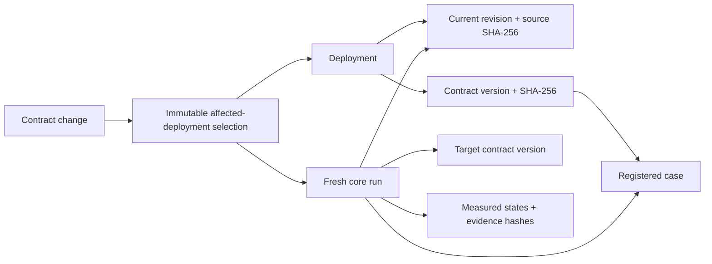

# Neo4j deployment selection

The user selected Neo4j on September 29, 2026. It stores explicit deployment,
revision, contract, case and measured-run relationships so a contract change can
select the deployments that need rechecking. It is off by default and requires
a real Neo4j database. Missing credentials, a missing driver or an unavailable
database cannot silently switch to memory or another storage backend.

The integration exposes authenticated worker APIs and a repeatable CLI demo.
Graph selection is not a verification verdict. The existing `proofrun.v1` core
runner remains responsible for execution, findings and repair outcomes; its
file-backed records and artifacts remain the canonical evidence.

## Relationship and evidence model

Registration supplies a deployment ID, full source revision, source SHA-256 and
explicit contract/case bindings. Contract IDs have separate versions identified
by their SHA-256. Current deployment relationships are updated atomically while
historical run relationships are retained. Nothing discovers dependencies from
model prose, inferred repository content or unverified deployment labels.



A change from one contract hash to another returns affected deployment IDs and
the explaining paths through their current revisions and previous contract
version. The selection captures these bindings. Subsequent deployment updates
cannot rewrite the original selection. Reusing a change identity with different
inputs is a conflict; unchanged old/new hashes are invalid.

Submitting a selected deployment requires its current revision/source and the
target contract to match the worker's registered fixture. A stale deployment,
different source or unsupported target contract is rejected before execution.
The first integration supports the existing `customer-nickname-v1` case and
comparison runs. Registration does not authorize arbitrary repository execution.

Retrieving a selection synchronizes terminal core-run evidence into Neo4j.
That evidence retains the execution/finding/repair states and exact input
bindings. An old revision or old-contract run cannot satisfy a new selection.
Completed execution, a graph relationship or a historical successful repair
cannot turn a newly selected deployment into an accepted repair.

Selection retries also bind the trusted tests, dependency pins, Dockerfile,
verifier and worker code. Changes invalidate earlier measurements even when
the application, contract and Git revision are unchanged. A private persisted
nonce prevents callers from preclaiming a selected job through the direct run
endpoint. Fresh retries retain prior terminal runs in the graph.

Selection responses use `proofrun.graph.v1`. Each deployment begins as
`requires_reverification`, then shows `queued` or `running` after dispatch.
`measured` means a native run executed every declared check with matching
bindings; it may still have found `regression_reproduced`. `inconclusive` retains
the need to recheck, while `superseded` means the captured bindings no longer
match the deployment or registered fixture. Measurement does not update the
registered dependency pin or approve a deployment.

## Private configuration

Use the worker's Python 3.12 environment:

```bash
python -m pip install -r requirements-worker.txt -r requirements-neo4j.txt
```

The optional driver is pinned separately; the normal worker install does not
need it while Neo4j is disabled. Keep all configuration in the main, ignored
`.env` and export it before starting the worker; the API does not automatically
load environment files.

| Variable | Meaning |
| --- | --- |
| `PROOFRUN_NEO4J_ENABLED` | `true` to enable; defaults to `false` |
| `NEO4J_URI` | Explicit database URI, such as `bolt://127.0.0.1:17687` locally |
| `NEO4J_USERNAME` | Database username; `neo4j` for the local Compose setup |
| `NEO4J_PASSWORD` | Private database password |
| `NEO4J_DATABASE` | Database name; defaults to `neo4j` |

Supported URI schemes are `bolt`, `bolt+s`, `bolt+ssc`, `neo4j`, `neo4j+s` and
`neo4j+ssc`. Credentials belong in their separate settings, not in the URI;
paths and query strings are rejected. For an existing authorized remote
database, use its actual URI, TLS scheme, username, password and database name.
An Aura account or instance is not provisioned by this implementation.

Unavailable graph operations return `503 graph_unavailable`. Independent core
verification remains available; it does not claim Neo4j selection.

Credentials remain in the worker and database environment. They are not sent
to the browser, graph evidence records, model prompts or verification containers.

## Start a local database

The repository includes a dedicated local Compose service. It uses
`neo4j:5.26.31-community`, the September 22, 2026 patch listed in the
[official 5.26 changelog](https://github.com/neo4j/neo4j/wiki/Neo4j-5.26-changelog).
HTTP and Bolt bind only to `127.0.0.1` on ports `17474` and `17687`. The container
has a two-CPU/two-GiB limit, a persistent data volume and an authenticated
readiness check. Heap and page-cache limits are explicit, following Neo4j's
[Docker configuration conventions](https://neo4j.com/docs/operations-manual/current/docker/configuration/).

For a new local database, run this from the repository root to fill missing or
empty Neo4j settings in the main, ignored `.env`. It preserves nonempty settings
and prints no secret. Use the configured Aura instance instead of this local
setup when its credentials are already present.

```bash
python - <<'PY'
import os
from pathlib import Path
import re
import secrets

path = Path(".env")
if not path.exists():
    fd = os.open(path, os.O_WRONLY | os.O_CREAT | os.O_EXCL, 0o600)
    os.close(fd)
content = path.read_text()
defaults = {
    "PROOFRUN_NEO4J_ENABLED": "true",
    "NEO4J_URI": "bolt://127.0.0.1:17687",
    "NEO4J_USERNAME": "neo4j",
    "NEO4J_PASSWORD": secrets.token_urlsafe(32),
    "NEO4J_DATABASE": "neo4j",
}
for key, value in defaults.items():
    empty = rf"(?m)^{key}=[ \t]*$"
    if re.search(empty, content):
        content = re.sub(empty, f"{key}={value}", content)
    elif not re.search(rf"(?m)^{key}=", content):
        content = content.rstrip("\n") + f"\n{key}={value}\n"
path.chmod(0o600)
path.write_text(content)
PY
set -a
source .env
set +a
docker compose -f deploy/neo4j/compose.yaml up -d --wait --wait-timeout 180
```

The password is required; Compose refuses an empty value. For an existing data
volume, keep its existing database password: `NEO4J_AUTH` initializes new data
and does not reset an existing database's credentials. See the
[Neo4j Docker setup guide](https://neo4j.com/docs/operations-manual/current/docker/introduction/).
Stop this service while retaining its data with:

```bash
docker compose -f deploy/neo4j/compose.yaml stop
```

For the HTTP routes, set `PROOFRUN_NEO4J_ENABLED=true` in the main `.env`, load
that file, then restart the worker:

```bash
set -a
source .env
set +a
python -m src.proofrun.api --host 127.0.0.1 --port 8766 --runner native
```

Use the same main `.env` as [normal setup](../README.md). Preserve the existing
bearer token and other integration settings.

## Worker API

Every route uses the existing `Authorization: Bearer <PROOFRUN_WORKER_TOKEN>`
boundary. Neo4j credentials are never HTTP request fields. These routes do not
replace `/v1/runs` or change `proofrun.v1`.

| Route | Request / effect |
| --- | --- |
| `POST /v1/deployments` | Register `deployment_id`, `revision`, `source_sha256`, and `contracts` containing `contract_id`, `contract_sha256`, `case_id` |
| `POST /v1/contract-changes` | Supply `change_id`, `contract_id`, `previous_sha256`, `contract_sha256`; persist the affected deployment selection and explaining paths |
| `GET /v1/contract-changes/{change_id}` | Return the recorded selection and synchronize its terminal core-run evidence |
| `POST /v1/contract-changes/{change_id}/runs` | Supply selected `deployment_id` and `job_key`; submit the matching registered case as a comparison run |

Obtain actual current fixture bindings from the authenticated
`GET /v1/cases/customer-nickname-v1` endpoint. Use full revisions and calculated
SHA-256 values, never invented hashes for a real deployment. Synthetic demo
identities and its earlier contract version are explicitly labeled as such.
Repeat requests use their durable identities; changing inputs under an existing
change identity must not overwrite its original claim. A deployment registration
can explicitly update its current bindings; a previous selection then becomes
superseded. Core run IDs, statuses and artifacts remain available through the
existing run endpoints. A newly submitted run returns HTTP `202`; an identical
retry returns the existing run with HTTP `200`. Stale selection bindings or a
conflicting change identity return HTTP `409`.

## Repeatable acceptance demo

Prepare the native Docker verifier images using the [worker setup](../README.md).
With the real database running and the private settings exported, run:

```bash
python -m src.proofrun.neo4j_demo \
  --output-dir .commit-watch/neo4j/my-fresh-acceptance
```

The CLI creates its own temporary authenticated localhost worker; a separately
running API process is not required. Choose a new output directory for every
execution. The acceptance scenario uses
three synthetic deployment registrations and two contracts. A change to one
contract must select exactly its two dependent deployments and include their
explaining paths. A selected deployment then executes a fresh comparison with
the native core runner. The receipt must preserve that run's bindings and
measured evidence and demonstrate that an old-contract run cannot satisfy the
new selection. It also checks that an identical submission reuses the run and
that a later unregistered contract target is rejected before execution.

Successful execution writes `receipt.json`, `run.json` and downloaded,
hash-checked `artifacts/` under the chosen directory. `worker/` and `selections/`
retain the underlying local records. The receipt labels the previous, secondary
and next contract hashes as synthetic metadata; only the current registered
contract executes. Namespaced synthetic nodes remain in the database, and the
receipt records their prefix. The demo does not clear existing graph data.

This scenario tests live Neo4j selection plus real local Docker execution of
synthetic fixture inputs. It does not prove a production deployment, an Aura
instance, Crusoe execution, generated repair, or a DuploCloud graph screen.
Mocked store/transport tests are separate implementation checks. Record the
actual receipt and outcomes in [the integration record](../INTEGRATION.md#10-user-selected-addition--neo4j)
after running the scenario; setup instructions alone are not execution evidence.

## Validation

The September 29 local acceptance passed against Neo4j Community **5.26.28**
and Python driver **6.3.1**, using a disposable database and real native Docker
checks. It selected exactly two of three synthetic deployments, executed all
14 declared checks, reproduced the expected regression and downloaded four
hash-checked artifacts. It verified idempotent retry and old-contract rejection.
The shipped Compose file pins **5.26.31**; that image was downloaded and its
Compose configuration validated, while the acceptance used the already cached
5.26.28 image. The temporary database was removed after evidence collection.

The focused graph, worker, verifier, proposal and research HTTP suite passed
**223 tests**, using mocks where appropriate. Reproduce the same checks with:

```bash
python -m pytest tests/test_neo4j_store.py tests/test_deployment_graph.py \
  tests/test_deployment_graph_api.py tests/test_proofrun_api.py \
  tests/test_proofrun_service.py tests/test_proofrun_runner.py \
  tests/test_proofrun_repair.py tests/test_failure_research_api.py -q
```

The measured receipt is at
`.commit-watch/neo4j/live-acceptance-1/receipt.json`; the underlying run,
artifacts and database relationship evidence are beside it. See the
[integration validation record](../INTEGRATION.md#neo4j-validation--september-29-2026).

### Configured free Aura instance

On September 29, the user approved free-only cloud setup. **ProofRun**
(`abaa7830`) now runs on **AuraDB Free**, confirmed at **$0/hour**. Its database
credentials were initially saved in `.env.neo4j` and are now consolidated in the
main, ignored `.env` with owner-only file permissions. No
management API key is required by this driver integration.

Encrypted connectivity and the complete selection/native-Docker acceptance
passed against Aura: two of three deployments selected, 14 checks executed,
four artifacts verified, and old-contract reuse rejected. Evidence is at
`.commit-watch/neo4j/aura-free-acceptance-1/`; the
[Aura validation record](../INTEGRATION.md#auradb-free-activation--september-29-2026)
documents the actual run and its limits. Use the existing main `.env`; do not
replace it with local Compose settings or expose its contents. Free instances
are subject to deletion after 30 days of inactivity according to the console.

The existing worker at `http://127.0.0.1:8766` has been restarted with these
settings. Its authenticated selection endpoint successfully queried the Aura
graph; health and registered-case checks also passed. Restart future workers
by loading the main `.env`, which contains the worker and Neo4j settings.

### Graphs on every fix

The local dashboard at `http://127.0.0.1:8765` shows **Fix evidence graph**
below each suggested fix. Saved source scans get a separate graph for each
finding. The DuploCloud extension embeds the same evidence model in fixture
results and each release finding. Select a node to see its recorded status,
fingerprints and relationships; use **Refresh graph** to retry a connection.

The workers expose authenticated `GET /v1/runs/{run_id}/graph` and
`GET /v1/release-runs/{run_id}/graph`. DuploCloud applies the existing workspace
and resource checks before proxying these routes. Release graph identities are
scope bound. The dashboard uses its same-origin `/api/graph` endpoint and reads
Neo4j settings from the main `.env`; browser responses never contain credentials.

Graphs contain bounded projections of saved authoritative records, persisted
as `ProofRunEvidenceGraph` and `ProofRunEvidenceNode` with `EVIDENCE_LINK`
relationships. A response is ready only after Neo4j read-back matches the
snapshot. Database outages show an unavailable state. In-progress runs show
pending; static suggestions show unverified nodes with no execution claims.
Graph relationships cannot approve a fix or replace verification evidence.

Per-fix live Aura evidence and worker restart receipts are stored under
`.commit-watch/neo4j/per-fix-graphs/`. The graph/API checks run with:

```bash
python -m pytest tests/test_evidence_graph.py tests/test_evidence_graph_api.py \
  tests/test_dashboard.py tests/test_proofrun_api.py tests/test_release_api.py -q
```
